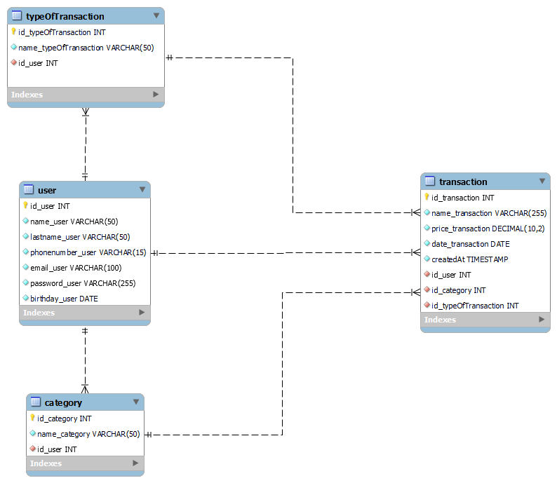

# JuraWallet

### Objetivo

O objetivo do projeto juraWallet é abordar o desafio comum enfrentado por muitas pessoas em relação à organização financeira. O juraWallet oferece uma plataforma centralizada para registrar e monitorar todas as transações financeiras dos usuários, fornecendo uma visão completa dos gastos ao longo do tempo.

### Funcionalidades

- Cadastro de novos usuários
- Resumo mensal e anual de entradas, saídas e saldo
- Criação, visualização, edição e exclusão de transações
- Cadastro massivo de transações, com modelo em formato csv
- Estatísticas mensais e anuais

### Técnologias utilizadas

- NodeJS
- Express
- Sequelize
- JWT
- BCrypt

### **Estrutura do projeto**
Banco de dados
[Diagramação do banco de dados MYSQL](https://raw.githubusercontent.com/luizjurazek/juraWallet-v2/main/banco-jurawallet.png)
